# Openpifpaf for Stereo BEV

## Installation

To install the environment, you can use the following steps.

### 0. UV

I use `uv` for faster installation. However it's optional, you can use `pip` directly if you prefer. Just ignore all `uv` prefixes in the commands below. To install `uv`, you can run:

```bash
curl -LsSf https://astral.sh/uv/install.sh | sh
```

or (not recommended):

```bash
pip install uv
```

### 1. Create and Activate a Virtual Environment

```bash
uv venv --python 3.10
source .venv/bin/activate
```

### 2. Install packages

For special need for certain torch versions, usually for RTX50 series GPUs, run the following command first:

```bash
uv pip install torch torchvision --index-url https://download.pytorch.org/whl/cu128
```

Others can skip this step.
Then install the required packages:

```bash
uv pip install -r requirements.txt
uv pip install -e .
```

## Usage

### Input Data

The structure of the input data should be as follows:

```
<input_dir>/
  ├── calib.txt
  ├── left.png
  ├── right.png
```

-   `calib.txt`: Calibration file containing camera parameters.
-   `left.png`: Left image.
-   `right.png`: Right image.

The file names are currently hardcoded, so please ensure they match.
Also, the data folder contains some example data, which can be used for testing. They should be removed from the repository in the future, but for now, they are useful for testing the code.

### Pretrained Model

The pretrained model of YOLOPv2 should be downloaded before running the code. You can run the following command to download it:

```bash
wget -P ./checkpoints https://github.com/CAIC-AD/YOLOPv2/releases/download/V0.0.1/yolopv2.pt
```

### Running the code

To run the code, you can use the following command:

```bash
python src/main.py <input_dir> \
  --output <output_dir> \
  --checkpoint shufflenetv2k16-apollo-24 \
  --instance-threshold 0.05 --seed-threshold 0.05 \
  --line-width 4 --font-size 0 --use_z
```

Or simply run:

```bash
bash run.sh <input_dir> <output_dir>
```

Also, you can run the hardcoded version:

```bash
bash example.sh
```

## Results

### Pipeline Overview

A single stereo image pair flows through two parallel branches — PifPaf for vehicles and YOLOPv2 for lane lines & drivable areas — which are then fused into the final Bird's Eye View.

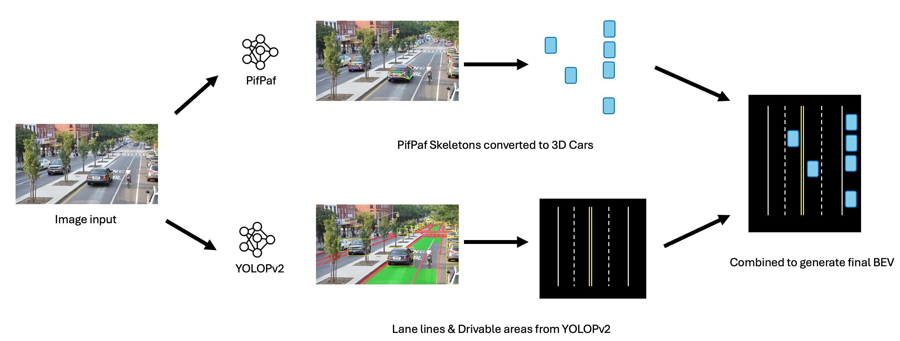

### Dataset

Geographic distribution of the data used in this project, spanning real-world captures across multiple countries together with synthetic samples.

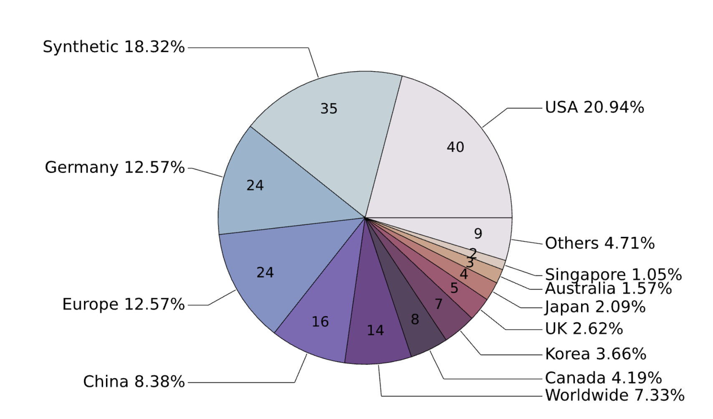

### Pseudo-LiDAR

Stereo depth is back-projected into a dense 3D point cloud, producing a LiDAR-like representation that drives the downstream geometry.

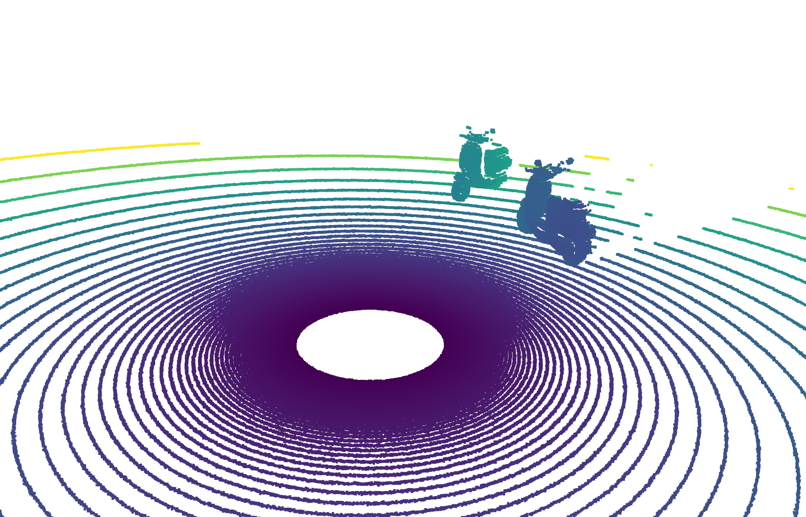

### Scene 1

Lane lines and drivable area extracted by YOLOPv2:

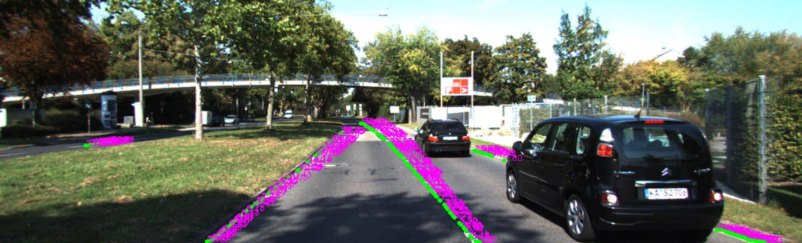

Vehicle keypoint skeletons detected and matched across the left/right stereo pair:

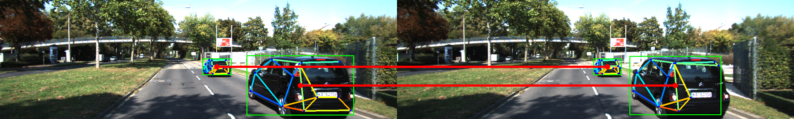

Raw Bird's Eye View, with vehicle keypoints and fitted lane lines projected onto the ground plane:

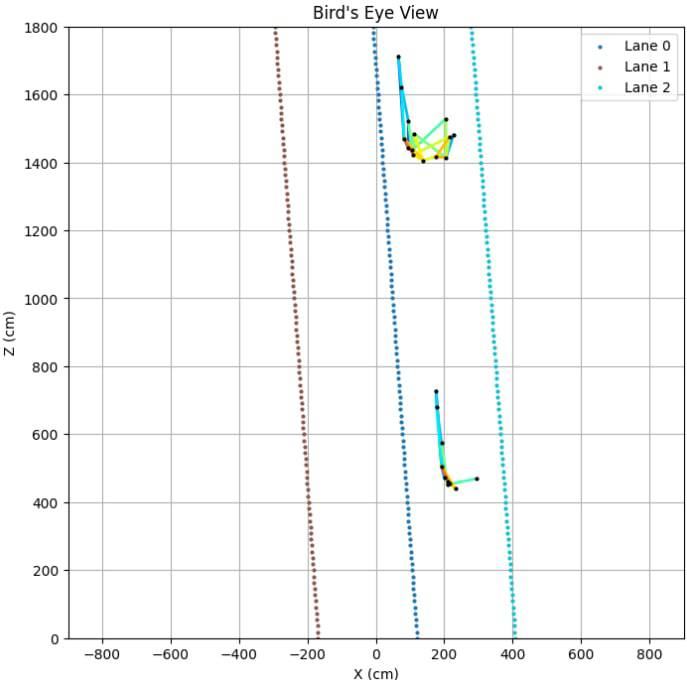

Reconstructed Bird's Eye View, with full 3D vehicle models registered against the keypoints:

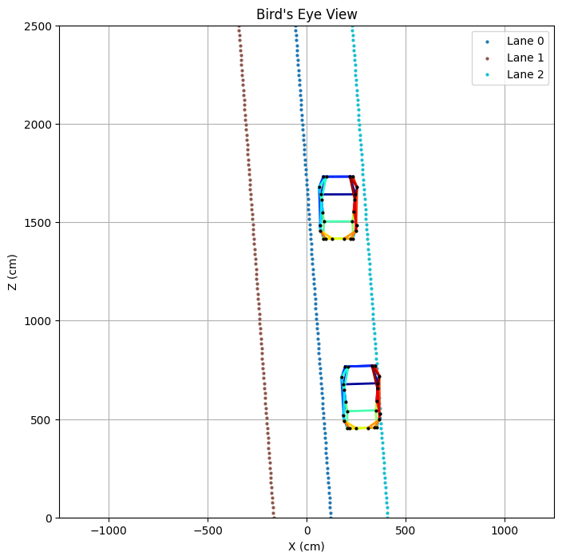

### Scene 2

Lane lines from YOLOPv2:

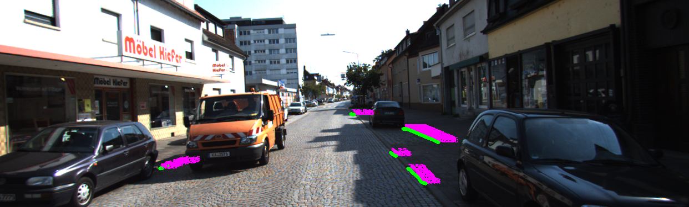

Vehicle skeletons matched across the stereo pair:

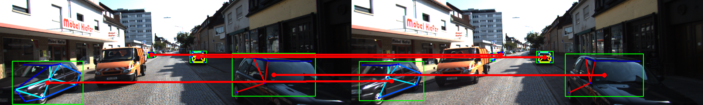

Final Bird's Eye View combining vehicles and lane lines:

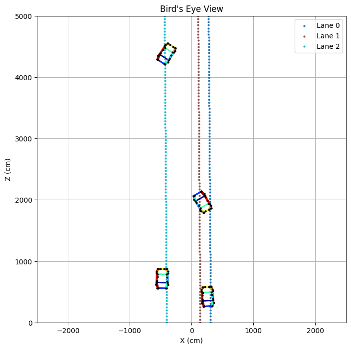

### Real-World Demo (Taiwan)

The pipeline applied to a street scene captured in Taiwan, with drivable area, lane boundaries, and detected vehicles.

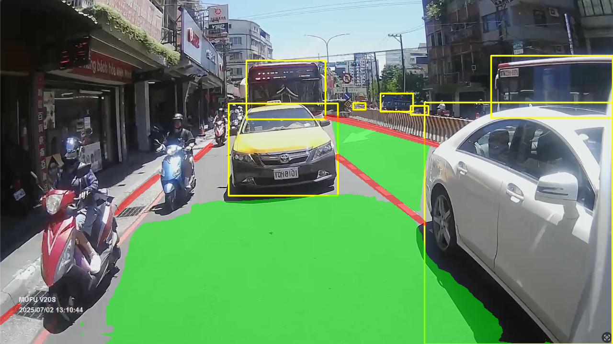

## Code Structure

The code is structured as follows:

```
src/
  ├── main.py  # Main script to run the BEV prediction
  ├── utils/
  |   ├── car/
  │   |   ├── matching.py  # Contains functions for matching vehicle centroids between left and right images
  │   |   ├── keypoint.py  # Contains functions processing car keypoints
  │   |   ├── registration.py  # Contains functions for car model and point cloud registration
  │   |   └── apollo_skeleton.py  # Contains functions to get the 24 points Apollo car model skeleton
  |   ├── lane/
  │   |   ├── yolopv2.py  # Contains functions for YOLOPv2 lane line detection
  │   |   ├── sampling.py  # Contains functions for sampling lane line points
  │   |   ├── matching.py  # Contains functions for matching lane line points between left and right images
  │   |   └── clustering.py  # Contains functions for clustering lane line points
  |   ├── common.py  # Contains common utility functions
  |   └── visualize.py  # Contains functions for visualizing the results
  └── openpifpaf/  # The original openpifpaf library
```
